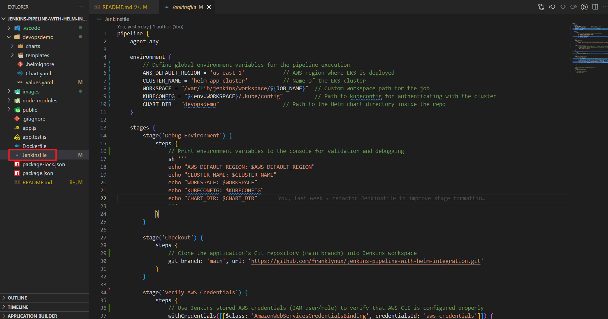

# Configuration Management With Helm

## Project Overview

This project introduces Helm charts and their integration with Jenkins to automate the deployment of a basic web application. It is designed to provide hands-on experience for beginners in DevOps, focusing on a simplified CI/CD pipeline using Jenkins and Helm.

---

## Table of Contents

1. [Prerequisites](#prerequisites)  
2. [Project Structure](#project-structure)  
3. [Jenkins Server Setup](#jenkins-server-setup)  
4. [Helm Chart Basics](#helm-chart-basics)  
5. [Working with Helm Charts](#working-with-helm-charts)  
6. [Integrating Helm with Jenkins](#integrating-helm-with-jenkins)  
7. [Troubleshooting](#troubleshooting)  
8. [Contributing](#contributing)

---

## 1. Prerequisites

Before starting, ensure you have the following installed:

- **Operating System**: Windows, Linux, or macOS
  *Note: This project would run on a dedicated Ubuntu (Linux) `t.3 small` EC2 instance on AWS. The below tools would be installed and configured on the same dedicated server.*
- **Jenkins**: Version 2.375 or later
- **Helm**: Version 3.0 or later
- **AWS CLI**: Installed and configured
- **Kubectl CLI**: Version 1.23 or later
- **Kubernetes Cluster**: A running Kubernetes cluster (e.g., Minikube, AKS, EKS, or GKE)
 *Note: EKS would be used for this project, so ensure to have the `eksctl CLI` installed, this would be used to provision and configure the kube cluster.*
- **Eksctl CLI**: Version 0.207.0 or later
- **Docker**: Installed and configured
- **Git**: Installed and configured

---

## 2. Project Structure

The project is organized as follows:

```
jenkins-pipeline-with-helm-integration/
├── Jenkinsfile
├── README.md
├── devopsdemo/
│   ├── Chart.yaml
│   ├── values.yaml
│   ├── charts/
│   ├── templates/
│   │   ├── _helpers.tpl
│   │   ├── deployment.yaml
│   │   ├── hpa.yaml
│   │   ├── ingress.yaml
│   │   ├── NOTES.txt
│   │   ├── service.yaml
│   │   ├── serviceaccount.yaml
│   │   └── tests/
│   │       └── test-connection.yaml
```

---

## 3. Jenkins Server Setup

### Jenkins Server Setup Objective

Configure Jenkins server for CI/CD pipeline automation.

### Jenkins Server Setup Steps

#### 1.1 Install Jenkins on a Dedicated Server

- Update system packages:

  ```bash
  sudo apt update
  sudo apt upgrade -y
  ```

  > **Screenshot Placeholder:**  
  > 

- Add Jenkins repository key:

  ```bash
  sudo wget -O /usr/share/keyrings/jenkins-keyring.asc \
    https://pkg.jenkins.io/debian/jenkins.io-2023.key
  ```

  > **Screenshot Placeholder:**  
  > 

- Add Jenkins repository:

  ```bash
  echo deb [signed-by=/usr/share/keyrings/jenkins-keyring.asc] \
    https://pkg.jenkins.io/debian-stable binary/ | sudo tee \
    /etc/apt/sources.list.d/jenkins.list > /dev/null
  ```  

  > **Screenshot Placeholder:**  
  > 

- Install Jenkins and Java:

  ```bash
  sudo apt update
  sudo apt-get install fontconfig openjdk-17-jre
  sudo apt install jenkins -y
  ```

  > **Screenshot Placeholder:**  
  > 

- Start and enable Jenkins service:

  ```bash
  sudo systemctl start jenkins
  sudo systemctl enable jenkins
  ```

  > **Screenshot Placeholder:**  
  > .png)

- Access Jenkins UI via `http://<your-server-ip>:8080`.

  > **Screenshot Placeholder:**  
  > 

### Initial Setup

1. **Access Jenkins**
   - Open browser: `http://<your-server-ip>:8080`
   - Get initial admin password:

     ```bash
     sudo cat /var/lib/jenkins/secrets/initialAdminPassword
     ```

   - Enter the password in the Jenkins UI to unlock Jenkins.

   > **Screenshot Placeholder:**  
   > 

2. **Install Suggested Plugins**
   - Jenkins will prompt you to install plugins.
   - Select "Install suggested plugins" to install default plugins like Git, Credentials, and Timestamper.

   > **Screenshot Placeholder:**  
   > 

3. **Create First Admin User**
   - Fill in the required fields to create the first admin user.

   > **Screenshot Placeholder:**  
   > 

4. **Configure Jenkins URL**
   - Set the Jenkins URL (e.g., `http://<your-server-ip>:8080`).

#### 1.2 Set Up Necessary Plugins

- Log in to Jenkins.
- Navigate to **Manage Jenkins** > **Manage Plugins**.
- Install the following plugins:
  - Pipeline Plugin
    > **Screenshot Placeholder:**
    > 

  - AWS credentials Plugin
     > **Screenshot Placeholder:**
     > 

#### 1.3 Configure Basic Security Measures

1. **Setup Authentication**:
   - Go to Dashboard → Manage Jenkins → Security
   - Under Security Realm, select "Jenkins' own user database"
   - Check "Allow users to sign up" (you can uncheck this later)

   > **Screenshot Placeholder:**  
   > 

2. **Configure Authorization**:
   - In the same Security page
   - Under Authorization, select "Matrix-based security"
   - Add admin user with all permissions
   - Add other users with specific permissions:
     - Overall: Read
     - Job: Build, Read, Workspace
     - View: Read
   - Click Save

   > **Screenshot Placeholder:**  
   > 

3. **Manage Users**:
   - Go to Dashboard → Manage Jenkins → Users
   - Add/remove users as needed
   - Set strong passwords
   - Disable sign-up option after adding necessary users

### Configure Credentials

1. **Add AWS Credentials**
   - Navigate to **Manage Jenkins** > **Credentials** > **System** > **Global credentials**.
   - Add credentials:
     - **Kind**: AWS Credentials
     - **ID**: aws-credentials
     - **Description**: AWS credentials for EKS access

   > **Screenshot Placeholder:**  
   > 

### Configure GitHub Webhook

1. **Setup Webhook in GitHub**
   - Go to your GitHub repository.
   - Navigate to **Settings** > **Webhooks** > **Add webhook**.
   - Configure the webhook:
     - **Payload URL**: `http://<your-jenkins-url>/github-webhook/`
     - **Content type**: `application/json`
     - **Events**: Push events

   > **Screenshot Placeholder:**  
   > 

2. **Verify Webhook**
   - GitHub will send a ping event to verify the webhook.
   - Check the webhook's recent deliveries for a successful response.

   > **Screenshot Placeholder:**  
   > 

---

## 4. Helm Chart Basics

### Helm Chart Basics Objective

Introduce the fundamental concepts of Helm charts.

### Helm Chart Basics Steps

### What is Helm?

Helm is a package manager for Kubernetes, designed to simplify the deployment and management of applications. It allows you to define, install, and upgrade even the most complex Kubernetes applications. Helm uses a packaging format called charts, which are collections of files that describe a related set of Kubernetes resources.

### Key Concepts of Helm

1. **Charts**
   - A Helm chart is a collection of files that describe a set of Kubernetes resources. It includes templates, configuration files, and metadata.
   - Charts are reusable and can be shared with others via Helm repositories.

2. **Releases**
   - A release is an instance of a chart running in a Kubernetes cluster. You can have multiple releases of the same chart, each with its own configuration.

3. **Templates**
   - Templates in Helm charts use Go templating syntax to dynamically generate Kubernetes manifests. This allows for parameterization and flexibility in deployments.

4. **Values**
   - The `values.yaml` file contains default configuration values for a chart. These values can be overridden during installation or upgrade to customize the deployment.

5. **Repositories**
   - Helm repositories are collections of charts that can be shared and accessed by others. The official Helm repository is hosted at [Artifact Hub](https://artifacthub.io/).

6. **Commands**
   - Common Helm commands include:
     - `helm install`: Deploy a chart to a Kubernetes cluster.
     - `helm upgrade`: Update an existing release with a new chart or configuration.
     - `helm rollback`: Revert a release to a previous version.
     - `helm list`: List all releases in the cluster.

### Benefits of Using Helm

- **Simplified Deployment**: Helm abstracts the complexity of Kubernetes manifests, making it easier to deploy applications.
- **Version Control**: Helm charts can be versioned, allowing you to track changes and roll back if needed.
- **Reusability**: Charts can be reused across different projects and teams, promoting consistency and efficiency.
- **Community Support**: Helm has a large community and a rich ecosystem of pre-built charts available in public repositories.

### Example Use Case

Imagine you need to deploy a web application with a backend service, a database, and a frontend. Instead of manually creating and managing multiple Kubernetes manifests, you can use a Helm chart to package all the resources together. This chart can then be deployed, upgraded, or rolled back with a single command.  

#### 2.2 Creating a Basic Helm Chart

- Use the command:  

  ```bash
  helm create devopsdemo
  ```

  

  - This creates a new Helm chart named `devopsdemo` in the current directory. This directory contains templates and configuration files.

  > **Screenshot Placeholder:**  
  > 

#### 2.3 Helm Chart Templating Basics

- Templates use Go templating syntax.
- Values can be parameterized in `values.yaml`.
- Templates are located in the `templates/` directory.

---

## 5. Working with Helm Charts

### Steps

#### 3.1 Deploy a Sample Web Application

- Provision a Kubernetes cluster using `eksctl`:

  ```bash
  eksctl create cluster --name helm-app-cluster --region us-east-1 --nodegroup-name helm-workers --node-type t3.small --nodes 2 --nodes-min 1 --nodes-max 3 --managed
  ```

  > **Note:** This command creates a managed EKS cluster named `helm-app-cluster` in the `us-east-1` region with a node group of type `t3.small`.

  > **Provisioning Cluster:**  
  > 

  > **Cluster ready:**
  > 

- Deploy the chart on the provisioned Kubernetes cluster using:

  ```bash
  helm install devopsdemo ./devopsdemo
  ```

  > **Helm Install:**  
  > 

  > **Helm App Deployed:**  
  > 

- Verify pods deployment with:

   ```bash
   kubectl get pods
   ```

   > **Get Pods:**  
   > .png)

- Verify service deployment with:

   ```bash
   kubectl get svc
   ```

   > **Get Service:**  
   > .png)

- Access the sample web application using the Load balancer's DNS name:

  

#### 3.2 Using Values and Templates

Helm charts are highly customizable through the use of the `values.yaml` file and Go templating. This allows you to tailor deployments to different environments or requirements without modifying the core chart templates.

- **Customizing values.yaml**:  
  The `values.yaml` file contains default configuration values for your chart. You can edit this file to set parameters such as image repository, tag, replica count, service type, resource limits, and environment variables. For example, to change the number of application replicas, update the `replicaCount` field:

  ```yaml
  replicaCount: 4
  ```

  > **Screenshot Placeholder:**  
  > 

  Common fields you may want to customize include:
  - `image.repository` and `image.tag`: Specify the Docker image and version to deploy.
  - `service.type`: Change between `ClusterIP`, `NodePort`, or `LoadBalancer`.
  - `resources`: Set CPU and memory requests/limits for your pods.
  - `env`: Define environment variables for your application.

- **Overriding values at install time**:  
  You can override any value in `values.yaml` directly from the command line using the `--set` flag. This is useful for quick changes or for CI/CD pipelines:

  ```bash
  helm install devopsdemo ./devopsdemo --set service.type=NodePort
  ```

  This command deploys the chart with the service exposed as a NodePort instead of the default type. You can override multiple values at once, for example:

  ```bash
  helm install devopsdemo ./devopsdemo --set image.tag=v2,replicaCount=2
  ```

- **Overriding values with a custom file**:  
  For more complex overrides, create a separate YAML file (e.g., `custom-values.yaml`) and use the `-f` or `--values` flag:

  ```bash
  helm install devopsdemo ./devopsdemo -f custom-values.yaml
  ```

  This approach is recommended for production deployments or when you need to maintain different configurations for different environments (e.g., `dev-values.yaml`, `prod-values.yaml`).

- **Template usage**:  
  The templates in the `templates/` directory use Go templating syntax to reference values from `values.yaml`. For example, the deployment template might use `{{ .Values.replicaCount }}` to set the number of replicas. This makes your chart flexible and reusable across different environments. You can also use conditionals and loops in templates to enable or disable resources based on values.

- **Viewing all available values**:  
  To see all values that can be set for a chart, use:

  ```bash
  helm show values ./devopsdemo
  ```
  .png)

  This command is helpful for discovering which parameters are available for customization, especially when using third-party charts.

- **Validating your values**:  
  After editing `values.yaml` or providing overrides, you can use the following command to render the Kubernetes manifests and verify the output before applying:

  ```bash
  helm template devopsdemo ./devopsdemo -f custom-values.yaml
  ```

  This helps catch errors in your values or templates before deploying to the cluster.

---

#### 3.3 Upgrading and Rolling Back Applications

Helm makes it easy to update your application and revert to previous versions if needed. This is especially useful for continuous delivery and safe deployments.

- **Upgrading a release**:  
  When you need to update your application (e.g., new image tag, updated configuration), modify `values.yaml` or your custom values file, then run:

  ```bash
  helm upgrade devopsdemo ./devopsdemo --values devopsdemo/values.yaml
  ```

  This command applies the new configuration to the existing release. You can also use `--set` for quick overrides:

  ```bash
  helm upgrade devopsdemo ./devopsdemo --set image.tag=v3
  ```

  > **Screenshot Placeholder:**  
  > .png)

  Helm will perform a rolling update of your application, minimizing downtime. You can check the status of the upgrade with:

  ```bash
  helm status devopsdemo
  ```

- **Viewing release history**:  
  To see the revision history of a release, use:

  ```bash
  helm history devopsdemo
  ```

  This will show a list of all deployments, upgrades, and rollbacks for the release, including revision numbers, dates, and status. This is useful for auditing and troubleshooting.

- **Rolling back to a previous version**:  
  If an upgrade causes issues, you can easily revert to a previous release revision:

  ```bash
  helm rollback devopsdemo 2
  ```

  Replace `2` with the desired revision number from the history. Helm will redeploy the application using the configuration from that revision. You can confirm the rollback with:

  ```bash
  helm status devopsdemo
  ```

   > **Rollback Command:**
   > 
   >
   > **Rollback Successful:**
   > 

- **Best practices**:
  - Always review changes in `values.yaml` before upgrading.
  - Use version control for your values files to track changes over time.
  - Test upgrades in a staging environment before applying to production.
  - Use descriptive revision messages with the `--description` flag for better traceability:

    ```bash
    helm upgrade devopsdemo ./devopsdemo --set image.tag=v4 --description "Upgrade to v4 with bug fixes"
    ```

  - Monitor your application after upgrades and rollbacks to ensure stability.

---

## 6. Integrating Helm with Jenkins

Now, we have successfully deployed a sample web application via helm on a kubernetes cluster (EKS) on a local machine. Next, we would integrate ***Jenkins with Helm*** to create a simplified CI/CD pipeline for application deployment.

### Steps

#### 4.1 Integrate Jenkins with Helm

Since we have Jenkins installed and configured on a dedicated server ( Ubuntu EC2 instance), to ensure seamless integration and deployment, the following should be installed and configured on the Jenkins server or agent:

- AWS CLI
- EKS CLI (eksctl)
- Kubernetes CLI (kubectl)
- Configured AWS credentials on Jenkins for Kubernetes cluster access.
- Add Helm commands, and also AWS credentials verification commands in Jenkins pipeline script.

#### 4.2 Configure Jenkins Pipeline for Helm Deployments

#### Configuring the Jenkinsfile

- Create a `Jenkinsfile` in your project root.

The Jenkinsfile is a text file that contains the definition of the pipeline. It includes stages for checking out the code, verifying AWS credentials, preparing the kubeconfig directory, and deploying the application using Helm.

This Project Jenkinsfile is structured into stages, each representing a step in the CI/CD process. The pipeline uses the `sh` command to execute shell commands, and `withCredentials` to securely access AWS credentials.
The pipeline is designed to be triggered by a GitHub webhook, which allows for automatic deployment whenever changes are pushed to the repository.
The pipeline includes the following stages:

- **Debug Environment**: Prints environment variables for debugging.
- **Checkout**: Clones the Git repository containing the Helm chart and application code.
- **Verify AWS Credentials**: Checks if the AWS credentials are valid.
- **Prepare Kubeconfig Directory**: Creates a directory for the kubeconfig file.
- **Deploy to EKS with Helm**: Deploys the application to the EKS cluster using Helm.

### Project Jenkinsfile

Below is the updated Jenkinsfile used in this project:

```groovy
pipeline {
    agent any

    environment {
        AWS_DEFAULT_REGION = 'us-east-1'
        CLUSTER_NAME = 'helm-app-cluster'
        WORKSPACE = "/var/lib/jenkins/workspace/${JOB_NAME}"
        KUBECONFIG = "${env.WORKSPACE}/.kube/config"
        CHART_DIR = "devopsdemo"
    }

    stages {
        stage('Debug Environment') {
            steps {
                sh '''
                echo "AWS_DEFAULT_REGION: $AWS_DEFAULT_REGION"
                echo "CLUSTER_NAME: $CLUSTER_NAME"
                echo "WORKSPACE: $WORKSPACE"
                echo "KUBECONFIG: $KUBECONFIG"
                echo "CHART_DIR: $CHART_DIR"
                '''
            }
        }

        stage('Checkout') {
            steps {
                git branch: 'main', url: 'https://github.com/franklynux/jenkins-pipeline-with-helm-integration.git'
            }
        }

        stage('Verify AWS Credentials') {
            steps {
                withCredentials([[$class: 'AmazonWebServicesCredentialsBinding', credentialsId: 'aws-credentials']]) {
                    sh 'aws sts get-caller-identity'
                }
            }
        }

        stage('Prepare Kubeconfig Directory') {
            steps {
                sh 'mkdir -p ${WORKSPACE}/.kube'
            }
        }

        stage('Deploy to EKS with Helm') {
            steps {
                withCredentials([[$class: 'AmazonWebServicesCredentialsBinding', credentialsId: 'aws-credentials']]) {
                    sh """
                    aws eks update-kubeconfig --region $AWS_DEFAULT_REGION --name $CLUSTER_NAME
                    helm upgrade --install devopsdemo $CHART_DIR --set image.repository=franklynux/devopsdemo,image.tag=${BUILD_NUMBER}
                    """
                }
            }
        }
    }

    post {
        success {
            echo 'Deployment successful!'
        }
        failure {
            echo 'Deployment failed.'
        }
    }
}
```

> **Screenshot Placeholder:**  
> 

---

#### Creating a New Pipeline Job in Jenkins

1. **Navigate to Jenkins Dashboard**
   - Open your Jenkins instance in a browser (e.g., `http://<your-server-ip>:8080`).

   > **Screenshot Placeholder:**  
   > 

2. **Create a New Item**
   - Click on the **New Item** button on the left sidebar.

   > **Screenshot Placeholder:**  
   > 

3. **Enter Job Name and Select Pipeline**
   - Enter a name for your job (e.g., `Helm-CI-CD-Pipeline`).
   - Select **Pipeline** as the project type.
   - Click **OK** to proceed.

   > **Screenshot Placeholder:**  
   > 

4. **Configure Pipeline**
   - (Optional) Add a description for your job.
   - Under **trigger** section, select **GitHub hook trigger for GITScm polling** to enable automatic builds on code changes.

   > **Screenshot Placeholder:**  
   > 

   - Under **Pipeline** section, select **Pipeline script from SCM** if your Jenkinsfile is in a Git repository, or **Pipeline script** to paste the script directly.
   - For **SCM**, select **Git** and provide your repository URL (e.g., `https://github.com/franklynux/jenkins-pipeline-with-helm-integration.git`).
   - Set the branch to `main` or as appropriate.
   - Set the **Script Path** to `Jenkinsfile` if it is in the root directory.

   > **Screenshot Placeholder:**  
   > 

5. **Save and Run the Pipeline**
   - Click **Save** at the bottom of the page.
   - On the job page, click **Build Now** to trigger the pipeline.

   > **Screenshot Placeholder:**  
   > 

---

## 7. Troubleshooting

### Common Issues and Solutions

#### Issue: Jenkins Pipeline Fails to Deploy Helm Chart

- **Cause**: Missing Kubernetes credentials in Jenkins.
- **Solution**: Ensure Kubernetes credentials are configured in Jenkins under **Manage Jenkins > Credentials**.

#### Issue: Helm Command Not Found

- **Cause**: Helm is not installed on the Jenkins server.
- **Solution**: Install Helm on the Jenkins server and verify the installation using `helm version`.

#### Issue: Kubernetes Cluster Unreachable

- **Cause**: Incorrect kubeconfig file or cluster configuration.
- **Solution**: Verify the kubeconfig file and ensure the cluster is running.

---

## 8. Contributing

We welcome contributions to this project! To contribute:

1. Fork the repository.
2. Create a new branch for your feature or bug fix.
3. Commit your changes with clear messages.
4. Submit a pull request.

For major changes, please open an issue first to discuss what you would like to change.

---

## Contact

For questions or support, please contact the project maintainer.
